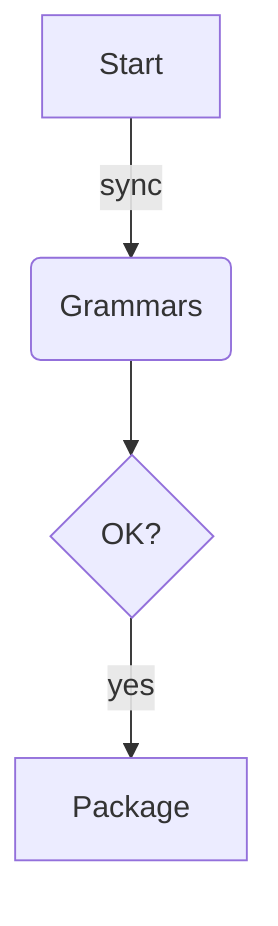

# Poly

A **unified** syntax pack.

- item one
- item two
  - [ ] nested task

```rust
fn main() { println!("hi"); }
```



```graphql
query User($id: ID!) {
  user(id: $id) { name email }
}
```

Inline math $t_{95} \leq 200$ and a block:

$$
\operatorname{p95}(f) = \max_{i} \left\lceil 0.95 \cdot |S_i| \right\rceil
$$

```math
E = mc^2
```

> quoted line with `code`
